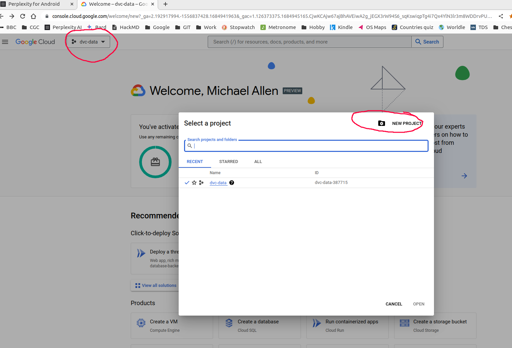

# Setting up Google Cloud Data Bucket

## Set up Google cloud authentication

If you are using Pop!_OS, will need to install the SNAP package manager with `sudo apt install snapd` (this is already present on Ubuntu).

Then install the Google Cloud authentication with `sudo snap install google-cloud-cli --classic`.

Once installed run the authentication client with `gcloud auth application-default login` - it will ask you to link a Google account.

### Troubleshooting

If necessary, activate account with `gcloud config set account [registered email address with Google]`

## Setting up a Google Cloud Data Bucket

Register at https://console.cloud.google.com/

Data storage of the type used here costs about 1p per GB per month (there is a three monthtrial with £300 credit available).

